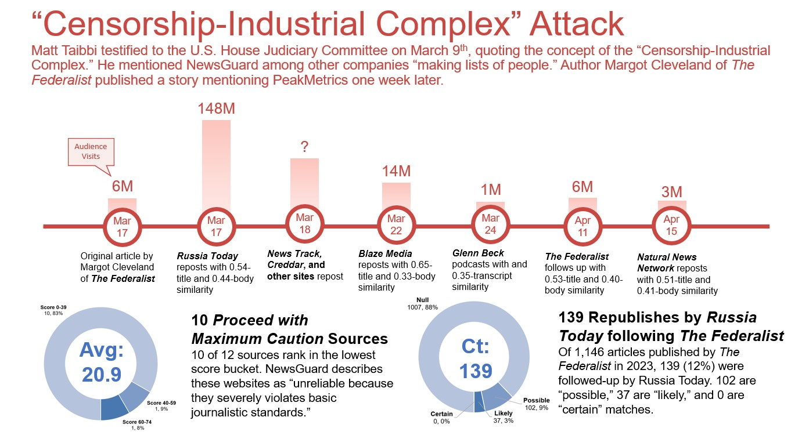

<!-- PROJECT LOGO -->
 

  <a href="https://github.com/drussel4/Vector-Embeddings">
    
    <!-- width="80" height="80" -->
  </a>

<h3 align="left">Vector Embeddings</h3>
  

    The goal of this analysis is to identify a news story's traction. After initial publish, what other outlets pick up the story? Do they regurgitate the article word-for-word, or rewrite and reference? What is the size of the audience of the distributed story? Do the subsequent outlets draw traffic back to the original article? Are the sources credible, or do they have a history of spreading mis- or disinformation? And what, if any, relationship is there between the original publisher and subsequent sites?
  

  

    This project sets out to begin answering those questions by using vector embeddings. Vector embeddings are a NLP method for calculating the similarity of two documents, or sentences. With a well-trained model, they allow us to measure the similarity between large batches of text, suggest the natural completion of a sentence, and more.
  

<!-- TABLE OF CONTENTS -->

  
Table of Contents

  <ol>
    <li>
      <a href="#about-the-project">About The Project</a>
      <ul>
        <li><a href="#built-with">Built With</a></li>
      </ul>
    </li>
    <li><a href="#license">License</a></li>
    <li><a href="#contact">Contact</a></li>
    <li><a href="#acknowledgments">Acknowledgments</a></li>
  </ol>

(<a href="#top">back to top</a>)

<!-- ABOUT THE PROJECT -->
## About The Project

  

To calculate cosine-similarity, I used the "all-MiniLM-L6-v2" model from <a href="https://www.sbert.net/docs/pretrained_models.html">Sentence-Transformers</a>. After some trial-and-error, I set a hurdle rate of 0.50. This means that articles having a title or a body with cosine >=0.50 compared with the original publish were counted as "possibly similar" and retained. I arrived at the hurdle rate of 0.50 is based on:
<ol>
<li>The results in the Source Comp tab, where a 0.60 "possibly similar" hurdle rate suggested matches worth reviewing</li>
<li>Reducing to 0.50 from 0.60 found ~50 more results, many of which are clear matches</li>
</ol>

Overall, the 0.50 hurdle rate is more accurately described as arbitrary than rigorously calibrated. 63 (2.3%) articles passed the hurdle rate - rejected 2,677 (97.7%). Of those passing, 6 surpassed the hurdle rate on both title & body, 37 exceeded on title, and 20 on body

(<a href="#top">back to top</a>)

### Built With

* [Python](https://www.python.org/)
* [Sentence-Transformers](https://www.sbert.net/docs/pretrained_models.html)
* [Bonsai OpenSearch](https://bonsai.io/)
* [PeakMetrics](https://www.peakmetrics.com/)
* [NewsGuard](https://www.peakmetrics.com/)

(<a href="#top">back to top</a>)

<!-- LICENSE -->
## License

MIT © David Russell

Distributed under the MIT License. See `LICENSE.txt` for more information.

(<a href="#top">back to top</a>)

<!-- CONTACT -->
## Contact

Dave Russell - [@data_dave_dr](https://twitter.com/data_dave_dr) - davidjeffreyrussell@gmail.com

PeakMetrics - [PeakMetrics](https://www.peakmetrics.com/contact)

Project Link - [https://github.com/drussel4/Vector-Embeddings](https://github.com/drussel4/Vector-Embeddings)

(<a href="#top">back to top</a>)

<!-- ACKNOWLEDGMENTS -->
## Acknowledgments

* [PeakMetrics](https://github.com/civicfeed) Concept & Data
* [Dave Russell](https://github.com/tappandave) Creator

(<a href="#top">back to top</a>)

